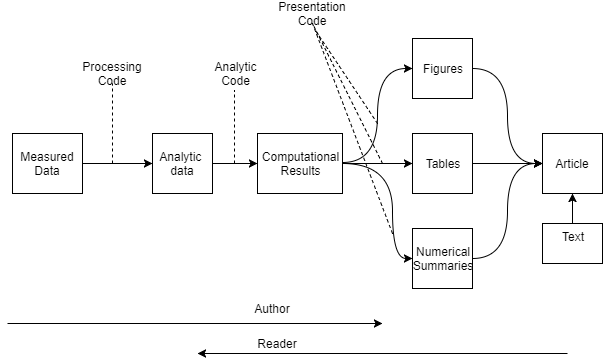

```{r setup, include=FALSE}
knitr::opts_chunk$set(echo = TRUE)
```
# Reproducing Research
There is no agreed upon method for documenting research.  

In music, there is - called a score. Includes enough info to almost exactly reproduce the music.  

If others can reproduce your results, then research is regarded as "correct"! If possible, should have independent  

- investigators
- data
- analytic methods
- laboratories
- instruments

The "reproducibility" is particulaly important in studies that impact policy or regulatory decisions.

Some studies cannot be replicated (lack of funds, time, data, etc). Rather than not replicatable at all, make analytic data avaialbe, so part of the results replicatable.

So, gold standard is to replicate the study entirely; worst standard is to do nothing to verify; in between is reproduce everything after data collection. So this validates the data analysis; but not the original data collection.

why?

- new tech increasing data collection, data are more complex/high dimensional.
- existing databases can be merged into mega databases.
- increasing computational analysis
- for every field X, there is a computational X (field as in astrology, biology, etc)

Example: air pollution and health research

- estimate small (but important) health effects in presence of much stronger signals
- results effect policy, can cost billions of $
- complex statistical methods, subject to increased scrutiny

When generating report, author works from left to right , but the reader of the article has to work from right to left.




