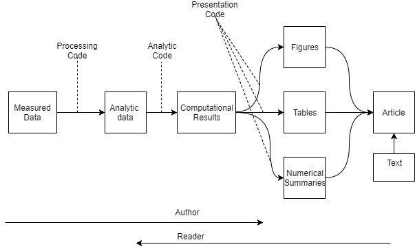

```{r setup, include=FALSE}
knitr::opts_chunk$set(echo = TRUE)
```
# Reproducing Research
There is no agreed upon method for documenting research.  

In music, there is - called a score. Includes enough info to almost exactly reproduce the music.  

If others can reproduce your results, then research is regarded as "correct"! If possible, should have independent  

- investigators
- data
- analytic methods
- laboratories
- instruments

The "reproducibility" is particulaly important in studies that impact policy or regulatory decisions.

Some studies cannot be replicated (lack of funds, time, data, etc). Rather than not replicatable at all, make analytic data avaialbe, so part of the results replicatable.

So, gold standard is to replicate the study entirely; worst standard is to do nothing to verify; in between is reproduce everything after data collection. So this validates the data analysis; but not the original data collection.

why?

- new tech increasing data collection, data are more complex/high dimensional.
- existing databases can be merged into mega databases.
- increasing computational analysis
- for every field X, there is a computational X (field as in astrology, biology, etc)

Example: air pollution and health research

- estimate small (but important) health effects in presence of much stronger signals
- results effect policy, can cost billions of $
- complex statistical methods, subject to increased scrutiny

When generating report, author works from left to right , but the reader of the article has to work from right to left.



## IOM Report
report generated for all the "omics" fields of study, to give some level of credibility (after a few cases where results were not reproducable)

- **data/metadata** available to public
- **code** and fully specified computational procedures sustainably available.
- code will **encompass all of the steps of computational analysis**. All areas of code need to be tranperantly available. 

What is needed for reproducable research

- analytic data is available
- analytic code is available
- doc code and data
- standard means of distribution

note: raw data may be interesting, but often not practical to publish.

Challenges:

- author: considerable work to publish
- reader: work to find and download, piece code and data together by hand
- reader may not have same resourses as author (eg enourmous computing cluster)
- few tools to help authors (but list is growning!)


what ends up happening:

- authors just put stuff on web
- (infamous) journal supplimentary materials
- only a few central databases where authors can publish

- readers manually put code and data together
- piece stuff together

## Literate (statistical) programming

* article is a stream of **text** and **code**
* analysis code is broken up into text and code chunks
* each code chunk loads data and computes results
* presentation code formats results (graphs, tables, figures, etc)
* article text explains what is going on
* literate programs can be **weaved** to produce human readable doc, and **tangled** to produce machine readable doc.
* original program to do this was **sweave**
* latex for human readable, R for machine readable
* sweave: http://statistik.lmu.de/~leisch/Sweave
* sweave has many limitations, 
  + latex very hard to learn
  + multiple plots per chunk
  + mixing programming languages
  + not frequently updated or actively developed.

* **knitr** alternative
* does everything that sweave does not
* uses R, but also other lang
* doc by markdown, latex, html, etc
* http://yihui.name/knitr
* developed by Yihui Xie

## Reproducable Research
Golden Rule: script everything

## Structure of Data Analysis
The steps:

* define the question
* define ideal data set
* determine what data you can access
* obtain data
* clean the data
* exploratory data analysis
* statistical prediction/modeling
* interpret results
* challenge results
* synthesize / write up results
* create reproducable code

part 1 - look at steps from beginning to clean data

Key challenge (from Dan Myer): "Ask yourself, what problem have you solved, ever, that was worth solving, where you knew all of the given information in advance? Where you didn't have a surplus of info and have to filter it out, or you had insufficient info and had to go find some?"

### Define Question

defining question is most powerful dimension reduction tool ever!

by narrow down on question, can remove a bunch of data that is unrelated to question, this simplifies everything enourmously.


1. statistical methods development
2. *danger zone*
3. proper data analysis

(1) is only done by specialist statitision maths guru's, not very common.
(2) getting data, and find random corrolations without understanding the science behind it is dangerours
(3) understand the science, look at the data, analysis - do stuff properly.
 
### Example: Can I automatically detect email that are spam or not.

#### define the question
First: make it concrete - can I use quantitative characteristics of the emails to classify them as SPAM/HAM?

#### define ideal data set
data set will depend on your goal

- descriptive: whole population (eg all the emails in the universe)
- exploratory: random sample with many variables measured
- inferential: the right population, randomly sampled - need to be very careful about the data set chosen. sampling method very important to choose carefully.
- predictive: test and training dataset from the same population
- caussal: data from randomized study (if I modify this, then this will occur)
- mechanistic: data about all compontents of the system.

Our example: best dataset would be all emails from gmail. But we cannot get access to that, so what is the next best solution?
May need to buy it.
Be sure to accept terms of use
if data dont exists, you may need to create it.

possible dataset from UCI Machine Learning
http://archive.ics.uci.edu/ml/datasets/Spambase


#### determine what data you can access
cannot access all of the gmail package, so make do with the URI machine learning package.

#### obtain data

- obtain raw data
- be sure to reference source
- polite emails go a long way
- if from internet, record URL and time accessed (incase it moves/deleted)

for our example, the spam/ham dataset is available as part of the kernlab package.


note, need to : install.packages("kernlab")

description of data
http://search.r-project.org/library/kernlab/html/spam.html

#### clean the data

- raw data often needs to be processed
- if pre-processed, make sure you understand how.
- understand source of the data (census, sample, convienience sample, etc)
- may need reformatting, subsampling - record these steps
- **determine if data are good enough** - if not, quit or change data.

So, lets view the sample data now

```{r}
library(kernlab)
data(spam)
str(spam[,1:5])
```


#### exploratory data analysis

so, lets look at the data now.
split the data in half with a coin flip to create a training data set and a test dataset.

```{r}
set.seed(3435)
trainIndicator = rbinom(4601, size=1, prob=0.5)
table(trainIndicator)
```
```{r}
trainSpam = spam[trainIndicator == 1,]
testSpam = spam[trainIndicator == 0,]
```

Now that the data has been subsampled,

- look at summaries of the data
- check for missing data
- create exploratory plots
- perform exploratory analyses (eg clustering)

```{r}
names(trainSpam)
# now look at the freq that each word occurs in each email.
head(trainSpam)


```

```{r}
# look at summary
table(trainSpam$type)
```

Lets plot stuff....see what the data looks like. In the log10 plots, add 1 to the results, as taking the log of 0 does not make sense.

First, lets look at the average occurance of capitol letters in mail, compared to whether the mail has been classified as spam (manual classification)
```{r}
plot(trainSpam$capitalAve ~ trainSpam$type)
```

to hard to read, so use the log10 value.
add 1 to get actual results - cannot do this in final results, but ok in exploratory only.
makes resulting plot readable.

can see that there is a definate higher occurance of the ave count of upper case letters in spam emails.

```{r}
plot(log10(trainSpam$capitalAve + 1) ~ trainSpam$type)
```

Relationship betweeen predictors


```{r}
plot(log10(trainSpam[,1:4] + 1))
```

Look at the clustering.
The first cut of this does not give very good results... only seperates out 1 or 2 clusters...


```{r}
hCluster = hclust(dist(t(trainSpam[, 1:57])))
plot(hCluster)
```


so try again with the log

```{r}
hClusterMod = hclust(dist(t(log10(trainSpam[, 1:57]+1))))
plot(hClusterMod)
```


#### statistical prediction/modeling

- should be informed by the results of exploratory analysis
- exacct methods depend on the question of interest
- transformations / processing should be accounted for when necessary
- measures of uncertainty should be reported


```{r}
trainSpam$numType = as.numeric(trainSpam$type) - 1
costFunction = function(x,y) sum(x != (y > 0.5))
cvError = rep(NA, 55)
library(boot)

#for(i in 1:55){
#  lmFormula = reformulate(names(trainSpam)[i], response="numType")
#  glmFit = glm(lmFormula, family = "binomial", data = trainSpam)
  # cvError[i] = cv.glm(trainSpam, glmFit, costFunction, 2)$delta[2]
#}
# names(trainSpam)[which.min[cvError]]
```

```{r}
lmFormula
```

#### interpret results

- use the appropriate language

  -- describes
  -- correlates with/associated with
  -- leads to/causes
  -- predicts
  
- give an explanation
- interpret coefficients
- interpret measures of uncertainty

in example:

- the fraction of characters that are dollar signs can be used to predict if an email is spam
- anything with more than 6.6% dollars signs is classified as spam
- more dollar signs always means more spam under our prediction
- our test set error rate was 22.4%

#### challenge results

- challenge all steps (before someone else does it for you!)
-- question
-- data source
-- processing
-- analysis
-- conclusions
- challenge measures of uncertainty
- challenge choices of terms to include in models
- think of potential alternative analysis.


#### synthesize / write up results

#### create reproducable code


